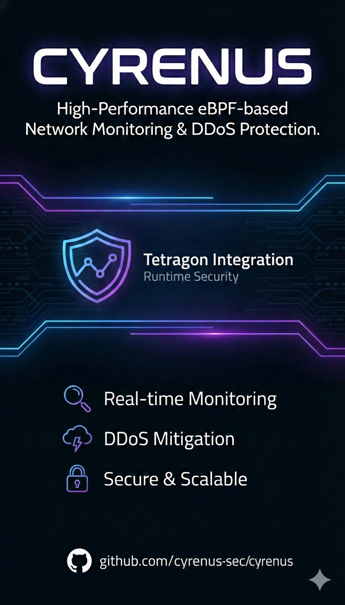

# Cyrenus



**Languages:** [English](readme.md) | [العربية](readme.ar.md)

Cyrenus is a high-performance eBPF-based network traffic monitoring and DDoS protection system, seamlessly integrated with Tetragon for runtime security.

## Installation

Choose the installation method that best fits your needs:

### Option 1: Quick Install (Binary) - **Recommended** ⚡

Fast installation using pre-built binaries. No compilation required!

```bash
curl -fsSL https://raw.githubusercontent.com/cyrenus-sec/cyrenus/main/install-binary.sh | sudo bash
```

Or download and run:
```bash
wget https://raw.githubusercontent.com/cyrenus-sec/cyrenus/main/install-binary.sh
sudo chmod +x install-binary.sh
sudo ./install-binary.sh
```

**Supported Architectures:**
- x86_64 (amd64)
- ARM64 (aarch64)

**Installation Time:** ~30 seconds

---

### Option 2: Build from Source

For development or customization, build from source:

```bash
sudo ./install.sh
```

This installs dependencies, builds Cyrenus, and configures everything automatically.

**Supported Distributions:**
- Ubuntu/Debian  
- RHEL/CentOS/Fedora
- Arch Linux

**Installation Time:** ~5-10 minutes

---

### Option 3: Docker Container

Run Cyrenus in a container:

**Build:**
```bash
docker build -t cyrenus .
```

**Run:**
```bash
docker run -d --name cyrenus \
  --cap-add SYS_ADMIN \
  --cap-add NET_ADMIN \
  --network host \
  -v /sys/kernel/btf:/sys/kernel/btf:ro \
  cyrenus
```

## Post-Installation

### 1. Configure Tetragon Policies
If you installed via `install.sh` or Docker, policies may already be applied. To apply manually:

```bash
# List active policies
sudo tetra tracingpolicy list

# Add policies
sudo tetra tracingpolicy add config/tetragon/policies/anti-rce.yaml
sudo tetra tracingpolicy add config/tetragon/policies/file-integrity.yaml
```

### 2. Verify Installation
Run the verification script to test security policies:

```bash
sudo bash tests/verify_policies.sh
```

## Features

- **DDoS Protection**: XDP-based packet filtering.
- **Tetragon Integration**: Runtime security for Anti-RCE and process monitoring.
- **Web Dashboard**: Real-time traffic analysis and control.

## Documentation
See `docs/` for architecture and API documentation.

## License
MIT
